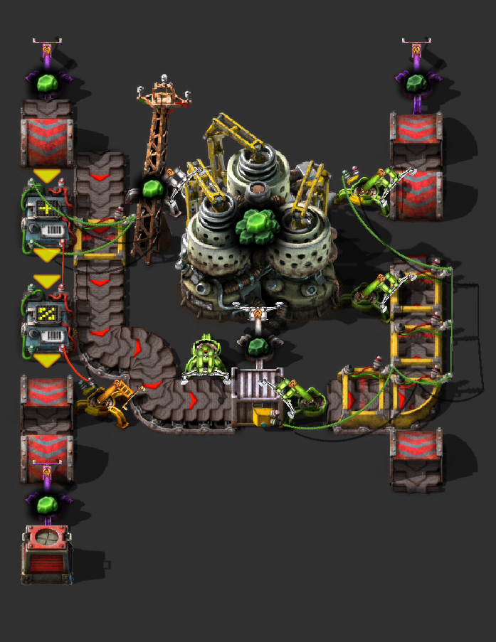

# U235 to U238

## 使用/Usage

蓝图截图

1. 右侧传送带进u238
2. 初始时需手动放入40个U235
3. 每次循环生产的多余1一个U235从左边传送带流出
4. 可以向下无限延申

### 代码/code

0eNrtWOFumzAQfhdL+zWosIFAIu3XHqOqIgLX1CoYZJuoXZUH2HtsL7Yn2Rm6kCaGAOk0aeqfpmBzn31333dnv5BNXkMludBk9UJ4WgpFVrcvRPGtSHLzTj9XQFaEayiIQ0RSmKdaJoLXhcv8kOwdwkUGT2RF93cOAaG55tCaaR6e16IuNiBxwsHAPc81SJcLBRL/QctVqfC7UhhMtBXEN6FDnsnKpVFwEyJI+0lr9xUwsC/obu+cQbPx0GE4AppZoGM7tN9BJ0q7GuerqpTa3UCuLTtfdvCsgc+4hLSdEVjsB2/t17hAuZUl/vYhHPnWP0NwDiEXVa2JBTA8ACaS64cCNE/dtCw2XCS6vBBMdgaHSadlma838JDsOH6PH3WG1zicNcaUGbjnUun1WXruuNQ1vjmsrJ3hfjXpqcDYWE/L6bICmbRrJJ9xVllrdMck5P2+2Zxo99osn5o/WwkgjvnBM+QGM8lDmJkgITsbxixKuUxrrttnw7V+Q3tL2BaHJaY4Ivl9vQVL9rMuVrRJDowVb7b6WO4SCU8uCMlTjI7QbiXLFJSyZUnUeUQn6aN7mXfeQOIzKwvpeAGIp7LkWAYGWNLmhc0By2sQ2QxeUu/E5QO+DoZ9bePkn/Q7EHKAj33UiknLCVyfKTmeeSiqRDa6sSK/vv8g01gT9iQ7pfNV1xujupTNB6CW4L6vx9MHKHiKMqRSDiIFt8J8uOT7n82EV0wQySaHdcaV+SUrLWvoRiUk2fohQVU160bXqNMZf963U4syQxvelNCGp4LnDA33iR71rylW3j8rVl2cAvq2GH2aUYxaB/cWJEu9sbh3oDgt+7zf9SYFZEYCIEdwLB9uVeYwXAMMS2w2w2nEO1bVltkfVDuNn3dCLhb1BXQxq8ScKSqz2Y5mK+piOQogvqJTXsRzegDaNQEDZ53lAMo7FOMLqnCcqeGEgjyiS21UGeVqB1LyDNZNzuACv8FbQT+c0ryJ3PaGPGcDmNgWhHQqAJu/g+WYvoP54xlIp9oOjmwD5C5qm9KDZ4RXr4yWGhb3KAsLJ58X2On2Rp4Qes7pbIK2+QNpsbDZjmYXrde9fRSt89b/pGj1dSEsnuj84O/q8X8XChaMDsVyPg/iDx70KOrI5s33Zt2/LhbvcP/q02t6r2jGbYjPrrh/GULs7/b8rjbn5Zar5qhpSiimlVJ8B+a+bIeN0AWHh+bkc+e0ubo6uqN3SJ7g2vHdbXsr96X/Tu4OZ2PfpVrVimkQLVnkB0EUIF33vwFk6SB3